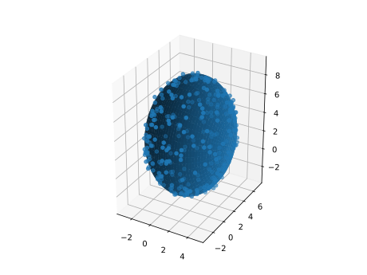

<h1>Fit an ellipsoid into set of points</h1>

Examples

<pre>
$  python main.py
0.9994041069805933 2.0062504550759472 2.9944729408734796
6.009341514057538 5.011980081763509 3.9935633406674236
</pre>

<pre>
$ python plot.py 
efit.svg
</pre>

